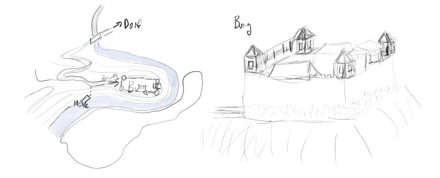

# Die Flucht

## Pre
- Schamane/Barde auf 2 runter bei Magie entwickeln und Spruchlisten
- Entzünden falsch gespielt. Es entzündet nichts anderes.
- Lederrüstung maximal, keine Schilde, 2GF Geld. Gegenstände teile ich aus.
- [ ] Item-Karten vorbereiten
- Wieviel kg wiegt ihr?

## Briefing
"Ihr seid politische Rebellen. Ihr habt gerade den Fürsten ermordert und eure Flucht ist misslungen. Ihr müsst euch nun auf eigene Faust weiterkämpfen. Ihr seid in einer kleinen Stadt in einer entlegenen Gebirgsregion."

## Verfolgungsjagd
- Die SCs sind Attentäter und sind auf der Flucht. Sie haben ein magisches Amulett und eine magische Waffe
- Der Fürst wurde immer älter, aber starb nie. Er herrschte mit Grausamkeit über das Land.
- Hauptquest: Lebend entkommen
- Nützliche Fähigkeiten:
  - Wissen (Magie) zum Identifizieren
- Nützliche Zauber: Entzünden (Elementare), Illusion (Freie), Licht und Dunkelheit (Freie), Genesung-Vergiftung (Wunder), Unterschlupf (Schamane Rang 4)
- Nützliche Items (Karten austeilen!):
  - Feuerstein und Zunder (für Lagerfeuer)
    - 0.3kg
  - Kleine Heilertasche
    - 2kg
  - Hammer, Kletterhaken, Seil (30m)
    - 0.5kg, 0.1kg, 0.2kg*30=6kg
  - Krähenfüße
    - 0.1kg
  - Jagdmesser
    - 0.5kg
- SCs starten mit
  - 1: 30% TP
  - 2-6: 50% TP
  - 7-0: 90% TP (und leichte Vergiftung, die erst im Verlauf der Story reinkickt)
    - Vergiftung: Je nach Schwierigkeitsgrad, vergiftet durch Schwert
- Nebenquests auf dem Weg:
  - Vergiftung heilen (Genesung oder seltenes Kraut Faulbaum)
  - Rausfinden, was die Gegenstände können und sie einsetzen  (Wissen - Magie)

## Gegenstände
- Amulett des Tausches: Das Amulett hat zwei Einstellungen. Der dunkle Stein ist oben -> TP werden 1:1 in MP umgewandelt. Der rote Stein ist oben -> MP werden 1:1 in TP umgewandelt. Die rote Einstellung hat den mächtigen Schwarzmagierfürst am Leben erhalten.
  - Inschrift: "Auf dieser Welt hat alles seinen Preis. Die Morgenröte schenkt dir Lebenskraft, das Schwarz der Nacht die Geistesmacht."
- Kurzschwert "Smert" (Norwegisch Schmerz): Schwarz, aus Drachenknochen
  - Giftschaden: 10%; Stacks: 10%/15%/20%/...
  - 2kg
- Magie entdecken
  - Jeweils MS10, wenn Effekt verwendet
  - MS14, wenn Effekt nicht beobachtet oder verwendet

## Station 1: Die Burg Kriebstein
- Der tote Fürst Fal
- Im Raum
  - Laterne (Öl unter dem Tisch)
    - 1kg, 0.5kg
  - Seesack (maximal 10kg)
  - Schnaps
    - 1kg
- Aus dem Zimmer entkommen: Wehrgang durchkämpfen, aus dem Fenster abseilen
- Verfolger: 

## Station 2: Der Fluss
- Am Fluss steht eine Wassermühle zur Zerkleinerung von Holz
- Müller Gaubold
- Ruderboot
- Flussfahrt
  - "Rafting"
  - 10 mal MS10 (GE/ST + Gewicht)
  - Gewicht in kg/Bonus:
    - 0-40: 0
    - 40-80: 1
    - 80-120: 2
    - 120+: 3
  - Fall: 1-2 TP Schaden
  - Kentern: 5%; 1 & (1-5)

## Station 3: Der Wald
- Epora (Advancement)
  - Fallenstellerin/Kräuterfrau
  - verkauft eine Bärenfalle
    - Immobilisiert
    - 1 TP Schaden bei Nicht-bewegen
    - 2-4 TP Schaden bei Bewegen
- Zeit um zu Entspannen

## Station 4: Die alte Mine
- Troll hat sich in der Mine eingerichtet
- Seilbahn mit Hanfseil (ggf. fehlt die Kurbel)
- SCs können den Troll besiegen oder warten bis er sich hinlegt
  - alternativ: Fallen bauen (Bärenfalle), ihn aus der Entfernung beschießen

## Random Encounter
- 4 Raben, die die SCs angreifen

## Kreaturen
- Rabe (SG 2.4): ️❤ 6 / Initiative 1 / Kampfbonus 2 / 🛡️ 4 / 🗡️ 0 / Fliegend / SG 2.4 / Schatz 3 KL (A)
- Adler (SG3)
- Wolf (allein) (SG3.5): ❤️ 12 / Initiative 2 / Kampfbonus 4 / 🛡️ 6 / 🗡️ 1 / SG 3.5 / Schatz 3 TT (C)
- Bär (SG5)
- Berglöwe (SG5): ❤️ 15 / Initiative 2 / Kampfbonus 8 / 🛡️ 6 / 🗡️ 1 / SG 5 / Schatz 3 GF (D)
- Troll (SG6): ❤️ 30 / Initiative 0 / Kampfbonus 8 / 🛡️ 7 / 🗡️ 0 / Regeneration 1 / SG 6.1 / Schatz 13 GF (D)
- Harpyie (SG10)