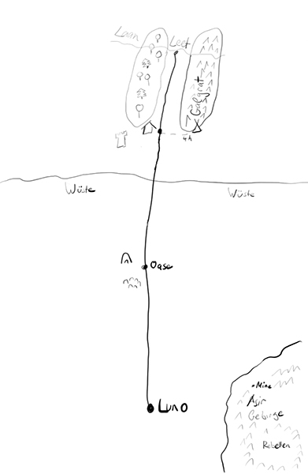

# Die Wüstenstadt

## Chronologie
- Kapitel 1: [Das überfallene Wirtshaus](/ueberfallene-wirtshaus)
  - Von Orks ausgeraubte Gaststätte
- Kapitel 2: [Der verlorene Goblinsohn](/verlorene-goblin)
  - Sidequest, um einen Goblin zurück zu seiner Familie zu bringen
- Kapitel 3: [Die Oase](/oase)
  - Oase mit Familie, der ein Kind abhanden gekommen ist. Das Kind befindet sich im Eingang einer Gruft.
- Kapitel 4: [Arena](/arena)
  - Wettkämpfe in der Arena für Ruhm und Ehre 
- Kapitel 5: [Detektei](/detektei)
  - Eine Detektei wird gebeten die Unruhen rund um den letzten Arenakampf aufzuklären
- Kapitel 6: [Der Coup](/coup)
  - Die SCs werde gebeten den Mord an Koreander aufzuklären
- Kapitel 7: [Der Skarabäus](/skarabaeus)
  - Ein seltener Käfer muss in einer Mine gefunden werden
- Kapitel 8: [Jagd auf Lothor](/lothor)
  - Der Mörder der Arena wird gestellt

## Backstory
- In Luno wird alle 4 Jahre ein Fest zu Ehren des Gottes Varus (Krieg, Wettkampf) gefeiert. Das Fest dauert 7 Tage und schon eine Woche vorher finden sich Gaukler, Händler und Schausteller in Luno ein um ihre Waren an Schaulustige zu verkaufen.
- Am Anfang des Festes findet ein großer Wettkampf in der Arena statt. Es werden diverse Disziplinen angeboten. Der Gewinner gewinnt den Ruhm und Jubel der ZuschauerInnen und Geld.
- Abends finden ausgelassene Feiern um die Arena statt.
- Die Feierlichkeiten im Tempel sind relativ langweilig und die meisten Leute in Luno zu verkatert, um daran teilzunehmen.

## Verbindungen zu den SC
- Farascha: Bekommt von Flanna das Kräuterbuch
- Leunnand: Bedankt sich bei TrinkFest als bestem Kunden seit langem und gibt ihm ein 5L Bierfass mit auf den Weg.

## Biom: Wüste
- In der Wüste muss jeder SC mindestens 3l Wasser am Tag trinken. 1l zusätzlich wenn sich viel in der Sonne bewegt wurde. Wer zu wenig trinkt bekommt nach 8h -1, 24h -2. Nach 48h ist derjenige tot.
- Kreaturen: Skorpione (groß, klein), Skelette (SG2), Erdelementar (SG 6)

## Luno
- 300k Einwohner
- Drogenproblem: Luno war schon immer eine sehr entspannte Stadt. Viele unterschiedliche Nationalitäten sorgten dafür, dass Regeln eher locker genommen wurden. Zum Varusfest werden auch allerhand Substanzen konsumiert (z.B. Mondstaub). Irgendwann wurde es allerdings den Priestern im Tempel zu bunt, nachdem jemand in einer Messe laut unter Drogeneinfluss laut rumkrakelte. Auch die Stadtwache beschwerte sich über die Zunahme von Beschaffungskriminalität und dunklen Gestalten, die sich in der Stadt breitmachten. Dadurch war der Stadthalter von Luno gezwungen mehr Kontrollen durchzuführen und besonders im Rahmen des Varusfestes (zumindest zu Beginn) mehr zu kontrollieren.

### Fraktionen
- Rebellen: Wurden von den ersten Siedlern aus Luno vertrieben/verdrängt. Glauben an andere Götter als das Empire (Problem mit Tempel). Agieren verdeckt im Untergrund gegen Tempel und König. Wohnen im Osten im Asir-Gebirge und bauen Dope an (Problem mit König). Wollen mehr Rechte und Vergeltung. Versorgen Stadt mit Erz (Schmied?).
- König: In Form des Stadthalters. Laissez-faire Politik, was Drogen angeht (Problem mit Tempel). Bekämpfen Rebellen im Osten. Exekutieren rebellische Attentäter. Führen Razzien gegen Kollaborateure durch (Problem mit Rebellen).
- Tempel: Konservative Ansichten. Rebellen sind Ungläubige (Problem mit Rebellen). Interne Machtkämpfe.

## Orte
- Norden: Stadttor 
- Zentral: Arena, Lazarett
- Westen: Markt, Bürgerviertel, Schmied, Kräuterfrau, Kaserne
- Osten: Taverne, ärmere Gegend

### Stadttor
- Einlasskontrolle (siehe Lunos Drogenproblem)
- 3 Stadtwachen SG 4
- 1 Wachhauptmann (wie Leibgarde)
- 2 Novizenmagier
- Novizenmagier wirken Erkenntnis (Rang 3) auf die Pferdewagen, die in die Stadt wollen, um Mondstaub zu finden
- Novizenmagier spürt die magische Kraft des Amuletts und fragt die SCs, was es ist und verweist sie an Rengaru/Zaubershop
- Wenn Mondstaub gefunden wird, wird die Person eingebuchtet oder gegen Zahlung von 10GF freigelassen

### Taverne zum tönernen Krug
- Herta: Wirtin, freundlich
- Pedro: Stallbursche, zurückhaltend
- völlig ausgebucht 
- Händler: Lennart (Schlangeneier), Gorn (Schmuck)
- Magiestudenten 
- Wilde Burschen: trinkfest

### Bar wider Vernunft
- Hippe Szenebar mit infusionierten Schnäpsen

### Bürgerviertel
#### Schmied
- Harod
- sehr an Farascha interessiert (Date 20 Uhr)
- im Bürgerviertel nahe des Markts
- hat alles was so üblich ist

#### Zaubershop
- Rengaru
- alter, zauseliger Mann
- manchmal Demenzattacken ("Wer seid ihr?")
- Interessiert sich mehr für Insekten als für Zauberartefakte
- Questline: [Skarabäus](/skarabeus)

#### Kräuterfrau
- Inga, Elfe
- führt viele Kräuter, auch die kleine Heilertasche
- Abneigung gegen Zwerge

#### Juwelier
- vornehmer Juwelier

### Markt
- Schlangeneierladen von Lennart
- Egons Laden
- Kartenzelt (Glücksspiel)

## Universität der magischen Künste
- Lehrstuhl Völkerkunde (inkl. Gnomologie) Rondalf

## Unterstadt
- Bordell Rote Laterne
- Taverne Zum Goldenen Handschuh
- Lagerhaus neben Taverne
- siehe [Detektei](/detektei/#orte)

## Kreaturen
- Leibgarde: ❤️ 45 / Initiative 1 / Kampfbonus 5 / 🛡️ 7 / 🗡️ -1 / SG 5
- Stadtwache: ❤️ 30 / Initiative 0 / Kampfbonus 5 / 🛡️ 7 / 🗡️ -1 / SG 4
- Novizenmagier: ❤️ 30 / Initiative 0 / Kampfbonus 2 / 🛡️ 5 / 🗡️ -1 / Magiepunkte 20 / Spruchliste 4 Weiße Magie / Stab / SG 5