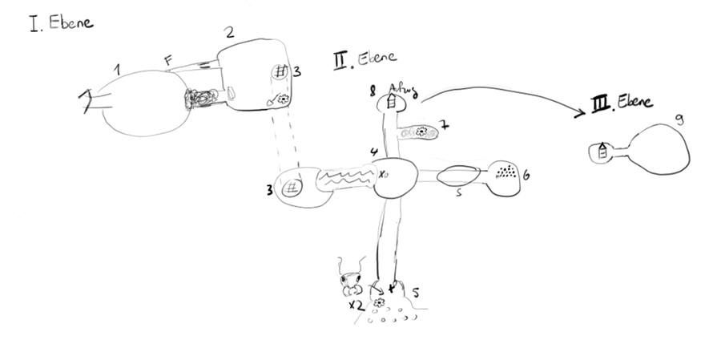

# Skarabäus

## Pre
- Auf Spürimpuls für Skarabäen bei Farascha achten (siehe Anmerkungen unten)
- Bei Rückkehr: Exekutionsszene mit Sahar von einem Kollaborateur

## Background: Rengaru
Rengaru ist ein Zwerg (65 J), der erst spät sein Ingenium entdeckt hat (bei Zwergen äußert selten). Daraufhin war er sehr erfolgreich und stand bei großen Herrschern im Dienst. Er bereiste die Welt und sammelte magische Artefakte. Er wurde nach Luno berufen, um dort die Universität zu leiten (30 J).

Er lernte einen jungen Elfenmann (Barion) aus einer angesehenen Lunoer Dynastie kennen und verliebte sich in ihn. Die Eltern waren dagegen und die Liebe endete tragisch (Suizid?). Dieses Ereignis stürzte den begabten Rengaru in eine psychische Krise. Er verlor sein Amt an der Universität und lebt seitdem in bescheidenen Verhältnissen (45 J).

Er flieht sich in das obsessive Sammeln von Insekten und lebt von seinem Vermögen aus vergangenen Tagen. Außerdem verdingt er sich als Händler von magischen Gegenständen, auch wenn er schon lange kein Interesse mehr daran hat. Seine magischen Fähigkeiten hat er völlig vergessen und kann sie nur noch als Routinefähigkeiten (Licht anmachen, etwas untersuchen) oder in starkem emotionalem Zustand (Wut) entfesseln. Er ist leicht dement. Ein Diener (Ron) vor seiner Tür erledigt die notwendigen Besorgungen und hebt ab und zu Geld von ihm von der Bank ab, um Miete u.ä. zu begleichen. Irgendwann hat er seinen richtigen Namen abgelegt (Utohl), sodass die SC an der Uni vielleicht noch Referenzen an einen ehemals großen Rektor finden. In Rengarus kleinem Laden findet sich keine Referenz mehr auf Barion, aber vielleicht bei einem seiner Hinterlassenschaften aus vorherigen Abenteuern.

Der Bruder von Rengaru heißt Gaudon.

## Timeline
- vor 150 Jahren
    - Königlichen kommen nach Luno und diskriminieren die Einheimischen (Rebellen)
- vor 100 Jahren 
    - Abenteurer finden im Asir-Gebirge im Osten Kohle, Erz und Iridium (erster Abbau)
- vor 90 Jahren
    - Rebellen fliehen in die Berge und besetzen die Minen
- vor 35 Jahren (alte Leute wissen es)
    - Rengaru (30 J) lernt Barion kennen
    - Rengaru besucht die Minen
    - Sahar (20 J)
- vor 20 Jahren (junge Leute haben davon gehört) 
    - Rengaru (45 J) hat Barion verloren
    - Sahar (35 J)
- heute
    - Rengaru (65 J) heute
    - Sahar (55 J)

## Die Aufgabe
- Die SCs sollen in eine nahegelegene Mine gehen, um dort den Seidspaltenskarabäus zu besorgen
- Er verspricht den SCs 100 GF dafür.

## Ort: Zaubershop
- Vor der Tür: Diener Ron
- Wände voll mit Bücherregalen mit vernachlässigten Büchern über Zauberei
- Rest der Wände voll mit Setzkästen
- Schreibtisch auch voll
- Alte Teetassen stehen rum
- Einige Ausstellungsvitrinen, verstaubt mit magischen Amuletten. Magisch verschlossen (MS 16 zum Öffnen). Amulette magisch gesichert (verflucht)
- Hinterzimmer: Toilette, Bad, Schlafzimmer, Hinterausgang

## Herausforderungen
- Tagebruch (draußen)
- Riesenameisen (draußen & drinnen)
- Grubengas (zündfähiges und nicht zündfähiges Methan, Kohlenstoffmonoxid, Kohlenstoffdioxid)
- Wasserschicht
- Giftige Pilze
- Marode Holzplanken an der Firste (Decke) oder an der Sohle (Boden)
- Marode Holzfahren (Leitern)

## Ort: Mine
Die alte Mine liegt einen Stunde vom Rebellenlager entfernt an einem Mittelgebirge. Einzelne Riesenameisen laufen außen herum.

### I. Ebene
#### 1: Vorraum
- Körbe, Spitzhacke
- F: Felsspalte mit Fallen (MS8 zum Entdecken) "Pfad der Pfähle"
    - Falle: Marode Holzbalken mit Pfählen (MS10 zum Entdecken, MS8 bei Vermutung)
        - 4+d6 Schaden
    - Falle: Stolperdraht mit Falltür von oben (MS10 zum Entdecken)
        - d10/2 Schaden für den vordersten SC
#### 2: Ehemaliges Rebellenlager
- Strohmatten, alte Feuerstelle, Zahnrad #1
- Schaufel
- Leiter
- Falle: Abbrechende Holme 10% Chance
    - Athletik/GE Save MS8, sonst d6 Schaden
#### 3: Leiter (unten)
- gefluteter Hohlraum

### II. Ebene
#### 4: Mittelraum
- Toter Rebell #1 (Piercer), halb aufgegessen
- Farascha merkt, dass die Käfer in der Nähe sind, eher links unten
#### 5: Ameisenbau
- Toter Rebell #2
- Zahnrad #2
- Erzader, relativ frische Luft
- 2 Riesenameisen verteidigen (warten oder kämpfen)
#### 6: Alter Lagerraum
- Reste von Kohlelagerung
- S: Senke mit CO2 (tote Ameise)
- Alte Kräutertasche von Rengaru (Brief mit Referenz zu Barion, alt, angeknabbert)
    - "Mein lieber Barion, diese Expedition war leider große Zeitverschwendung. Ich hatte gehofft in dieser Mine auf eine Iridiumader zu stoßen, aber der Weg weiter nach unten ist versperrt. Zumindest habe ich ein paar interesante Insekten gefunden und die trockene, abgestandene Luft erinnert mich an meine Heimat. Aber das ist alles ein schwacher Trost. Wäre ich doch bei dir in Luno geblieben. Wir hätten uns ein paar schöne Tage gemacht... Für immer, dein Rengaru."
#### 7: Unfertiger Stollen
- Grubengas
    - Kennzeichnung mit Andreaskreuz
    - Vorsichtige Explosion 2+d6 Schaden
    - Fahrlässige Explosion 6+d10 Schaden
- Zahnrad #3
#### 8: Aufzug
- Muss mit Zahnrad #1-3 repariert werden

### III. Ebene
#### 9: Basiliskenhöhle
- Farascha merkt, dass die Käfer in der Nähe sind, direkt gerade aus
- Versteinerte Ratten
- Im Kot der Basilisken lebt der Skarabäus
- Schatz: 30 kleine Iridiumbrocken für Bolzen (15)/Kugeln(30), großer Iridiumbrocken (100 Bolzen oder besonderes Schwert)

## Ort: Rebellencamp
- Anführerin (Sahar) der "Kinder der Nacht"
- Ausrüster (Osha)
- Rauchzelt
    - Buddler Erol
    - Wirt (Gerrin)
- Schmiede
- Schlote (Rennöfen)

## Hintergrundwissen: Bergbau
- Knappenvereine (Kranken- und Sterbekassen)
- Kumpels, Hauer
- arbeiten mit Hacke und Schaufel
- Außen: Kohlenniederlage/Halde als Zwischenlagerung
- Kohle für Eisenverhüttung (Koks-Kohle)
- Grubenwasser muss abgepumpt werden
- Holzstempel werden zum Stützen eines Stollens verwendet
- Grubenpferde
- Flöz: parallel zur Gesteinsschitung verlaufende Lagerstätte eines Rohstoffs
- Alter Mann: Abgebautes Flöz
  - Tagebruch: Absacken eines Hohlraums über Tage
  - Bewetterung: Frischluftversorgung des Stollens, sonst Gasansammlung (Methan)
  - Andreaskreuz zur Kennzeichnung
- Pütt: Bergbau oder Zeche
- Stollen gebaut, um Grundwasser abzuleiten
- Förderturm
- Schacht/Schachtanlage
- Religiöse Bergleute, da Beruf gefährlich
- Phasen:
  - Abbau des Bohnerzes
  - Waschen in Körben
  - Rennofen/Rennherd
  - Brennen in Doppelspitzbarren oder Weiterverarbeitung

## Kreaturen
- Rengaru: ❤️ 20 / Initiative 1 / Kampfbonus 0 / 🛡️ 6 / 🗡️ 0 / Magiepunkte 60 / Spruchliste Weiß 10/Elementar 7/Frei 7 / Gezielte Sprüche 4 / SG 12.1 / Schatz 1 kGF (F)
  - Standardrepertoire: Entzünden von Kerzen etc., Erschaffung von kleinen Sachen, Wissen, Erkenntnis auf andere (Oft an der Uni eingesetzt, um langsamen Studenten auf die Sprünge zu helfen)
  - Sprüche: Explosion, Unsichtbarkeit, Elementar, Schlaf, Reise max: 52km, Wahre Sicht auf die SCs
- Piercer: ❤️ 12 / Initiative -2 / Kampfbonus 1 / 🛡️ 7 / 🗡️ 0 / SG 2.4 / Schatz 3 KL (A)
- (Riesen-)Ameise: ❤️ 24 / Initiative 1 / Kampfbonus 3 / 🛡️ 6 / 🗡️ 0 / SG 3.5 / Schatz 3 TT (C)
- Basilisk (Versteinerungsblick): ❤️ 30 / Initiative 1 / Kampfbonus 4 / 🛡️ 8 / 🗡️ 1 / Versteinerungsblick / SG 6 / Schatz 5 GF (D)
- Riesenspinne
- Wurm
- Maulwürfe
