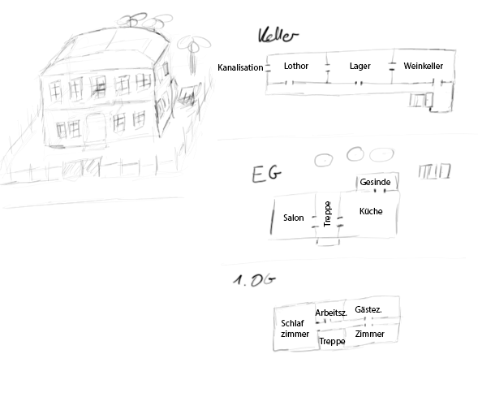

# Jagd auf Lothor

## Pre
- Sahar kann Botschaften an Herta schicken, um den SCs Aufgaben zu geben
- Dal: SCs haben nach einer Audienz bei Meera gefragt
- 4/24 Skelette sind erledigt. Die Restlichen warten auf ihre Chance
- Ende: Vormittags beim Kerker
- Farascha ist mit Harod für Morgen Abend verabredet (aufgearbeiteter Dolch zurück)
- [ ] Kampf mit Lothor planen
- [ ] Gespräch mit Meera planen

## Background: Lothor
- Alter Gnom
- "Der Zweck heiligt die Mittel", überheblich
- Meister der Tarnung
  - Goldener Tarnring: +5 auf Tarnung, aber der Ring ist immer sichtbar
- Artefaktjäger
- Magie
  - Schwarze Magie Stufe 8
    - Magisches Feuer
    - Beschwörung (Imp 4, Gremlin 6)
    - Bindung (im Quartier, in Glasphiolen 4)
    - Schwarzer Goblin (beschwört): ❤️ 8 / ini 0 / kb 2 / 🛡️ 6 / 🗡️ -2 / SG 2 / Schatz 1 KL (A) / Dolch oder Schleuder
    - Imp 4: Fliegend, lästig, Krallen; ️❤️ 20 / ini 0 / kb 2 / R 7 / S 2/ SG 4
    - Gremlin 6: Laufend, Stark; ❤️ 30 / ini 0 / kb 4 / R 8 / S 2 / SG 6
  - Weiße Magie 4
    - Linderung
    - Schutz
  - ❤️ 40 / ini 0 / KB 3 / 🛡️ 6 / 🗡️ -1 / MP 66 / Schwarz 8 / Weiß 4 / SG 10
- Gegenstände
  - Schwarzer Zauberstab des Goblinbeschwörers 12/30
- Von Meera in einem Grab aufgegriffen, dann verknackt
- Bei Verlegung "geflüchtet". Meera lies den Knastwagen bei seiner Verlegung überfallen
- Hat Carla mit Wettschulden erpresst als alte Dame
- Hat sich als alte Frau Gertrude ins Lazarett eingeschlichen und nachts die drei verbliebenen Magiestudierenden mit Gift getö†et

## Ort: Knast
- Knaster Brom
  - alter Mann am Empfang
- Schwarzer Flügel
  - Hier werden Schwarzmagier eingeknastet
  - Die Zellen sind magisch und entziehen den Eingesessenen die MP. 
- Boran
  - Bekannter von Lothor
  - Kennt das Artefakt und hat noch eine Rechnung mit ihm offen (gestohlenes Artefakt o.ä.)
- Friedhelm & Marlies
  - Friedhelm mit seiner Laute
- Lutz
  - Quest: [Detektei](/detektei)

## Quest: Lothor anlocken
- Verbreiten, dass man ein Artefakt besitzt
- Lothor wird versuchen zu kommen, um es sich zu holen
- Verbindung zu Meera nur feststellbar, wenn die SC ihm folgen und ihn nicht sofort abmurksen

## Ort: Taverne Zum goldenen Handschuh
- Wirt: Thorald

## Ort: Kanalisation
- Offene Tür in Seitenstraße in der Nähe der Taverne ist Eingang
- 1.8m hoch; oben aberundet; links Grube mit Abwasser, rechts schmaler Steg, breit genug für eine Person
- Ab und zu Löcher von oben, aus denen Abwasser reinfließt
- Begegnungen: Ratten, verfolgenden Skelette (20/24)
  - Skelett (stark): ❤️ 20 / Initiative 1 / Kampfbonus 4 / 🛡️ 6 / 🗡️ 1 / Zauberresistenz 1 / SG 4 / 1 TT

## Ort: Meeras Damenhaus
- in der Oberstadt
- Keller:
  - Weinkeller
  - Lager: Holz, Lebensmittel (Kartoffeln)
  - Lothors Versteck
- EG:
  - Garten mit Gärtner
  - Eingang von der Straße
    - 2 Wachpersonen
  - Salon
  - Küche
    - Küchenhilfe
  - Gesinde
- 1.OG: Schlafzimmer, Arbeitszimmer, Gästezimmer, Zimmer
  - Meera

## Lasagnes Verhaftung
- Valerius in Sänfte mit 4 Trägern und 4 Wachen (=Stadtwache); Stadtwachen kommen schnell hinzu, da neben der Kaserne
- Lasagne geht in U-Haft zu Marlies und Friedhelm (Überbelegung)
