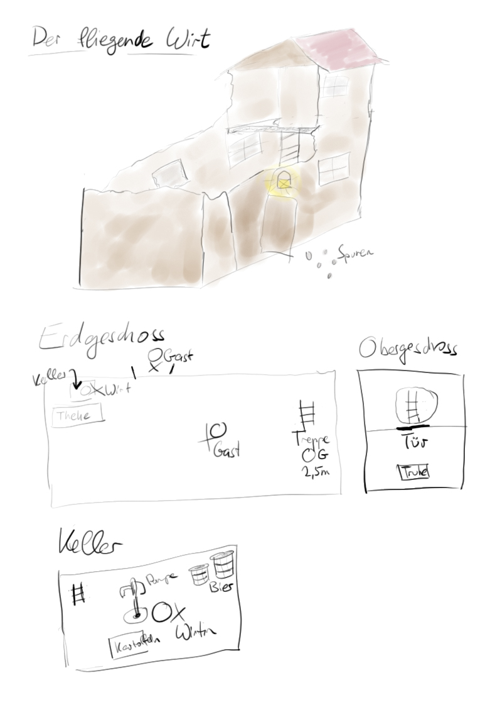

## Gasthof zum fliegenden Wirt
- Auffüllstation, gebrandschatzt von Orks in der Nacht zuvor, Häuptling wurde von Königlichen entführt, jetzt wollen sie rache. Sind auf Expedition nach neuem Zuhause. 4xSG3, 1 Schamane SG5
- Leichen:
  - Wirt
  - Frau des Wirts (im Keller): keine Kampfspuren (Vergiftung?)
  - 2 Gäste
- Camp der Orks ist 10km entfernt

## Kreaturen
- Ork: ❤️ 12 / Initiative 0 / Kampfbonus 3 / 🛡️ 7 / 🗡️ 0 / Kurzbogen(S-1)/morgenstern(S1)/Kurzschwert(S-1)/Einhand-Axt(S0) / SG 3 / 1 TT
- Ork Schamane / ❤️ 20 / Initiative 0 / Kampfbonus 4 / 🛡️ 6 / 🗡️ 0 / Magiepunkte 20 / Spruchliste 3 Heilen, Trance, Heiliger Bezirk / SG 5.5 / Heilsalbe 1 Anwendung 2 GF

## Reflektion
- kleine Details machen es aus (Tote in Wirtshaus haben noch ihr Geld)
  - aber auch "Woran ist die Frau im Keller gestorben?"
- Orientierung muss sichergestellt werden
- Kampfausrichtung eines SCs bemisst sich hauptsächlich am Beruf (Krieger > Dieb/Waldläufer/Priester > Barde/Schamane > Zauberer)
- Schleuder ist mit -2 im Kampf zu schwach. Macht eigentlich nur -1.